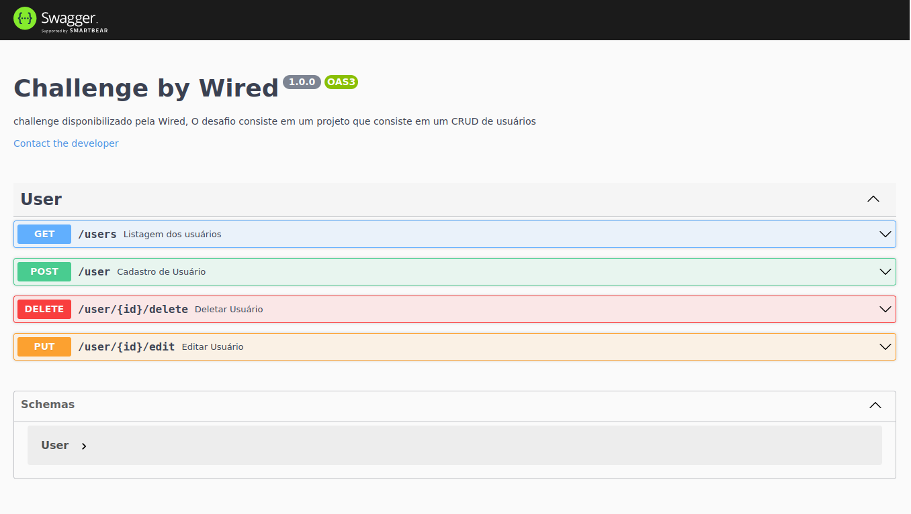

<h2>  Sobre o projeto</h2>
<p>
    Desafio imposto pela <a href="https://github.com/Wiredcraft">Wired</a> que consiste em uma API, que tenha a função de manuseio de Usuários, podendo ser criados, deletadas, e listados.
</p>

<br>

<h2> Técnologias usadas no projeto</h2>

<li><a href="https://www.typescriptlang.org/">Typescript</a></li>
<li><a href="https://typegoose.github.io/typegoose/">Typegoose</a></li>
<li><a href="https://mongoosejs.com/">Mongoose</a></li>
<li><a href="https://prettier.io/">Prettier</a></li>
<li><a href="https://eslint.org/">EsLint</a></li>
<li><a href="https://swagger.io/">Swagger</a></li>

<br>

<h2>  Pré-requisitos: </h2>
<li><a href="https://git-scm.com/">Git</a></li>
<li><a href="https://nodejs.org/en/">Node.js</a></li>

<br>

```bash
    # clonar repositório
    git clone http://github.com/ruanvsrateira/backend-wired-challenge.git
    # Entrar no repositório
    cd backend-wired-challenge
    # Instalação de dependencias
    npm i
    # ou
    yarn i
    npm run dev
    # ou
    yarn run dev
    # Buildar projeto
    npm run build
    #ou
    yarn run build
    #Rodar projeto buildado
    npm run start
    #ou
    yarn run start
```

<br />

<h2>
 A Documentação estará disponível na rota <a href="http://localhost:3333/api-docs">/api-docs</a></h2>

<h3>Demonstração:</h3>

<hr>

Desenvolvido por <a href="https://www.linkedin.com/in/ruanvsrateira" target="__blank">Ruan Victor</a>
